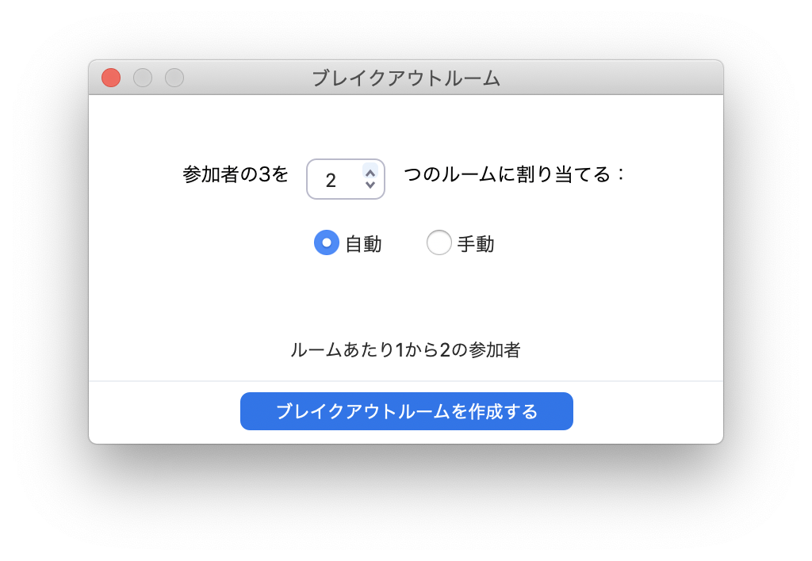
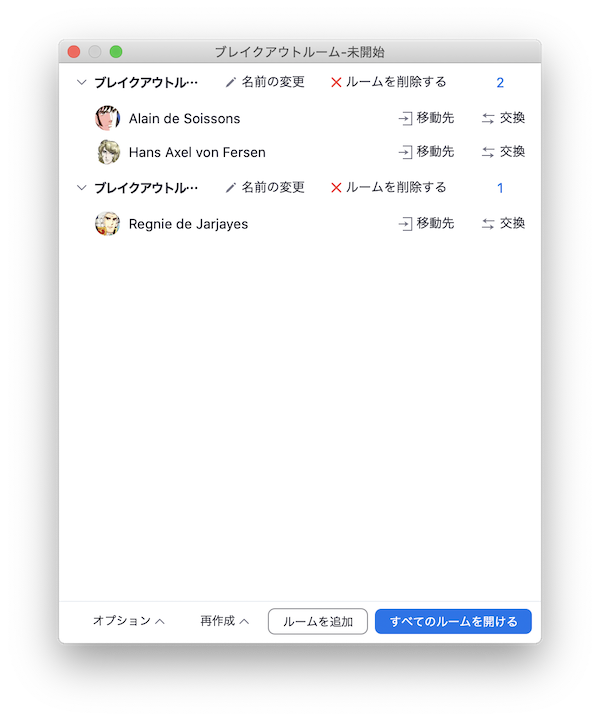
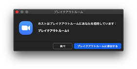
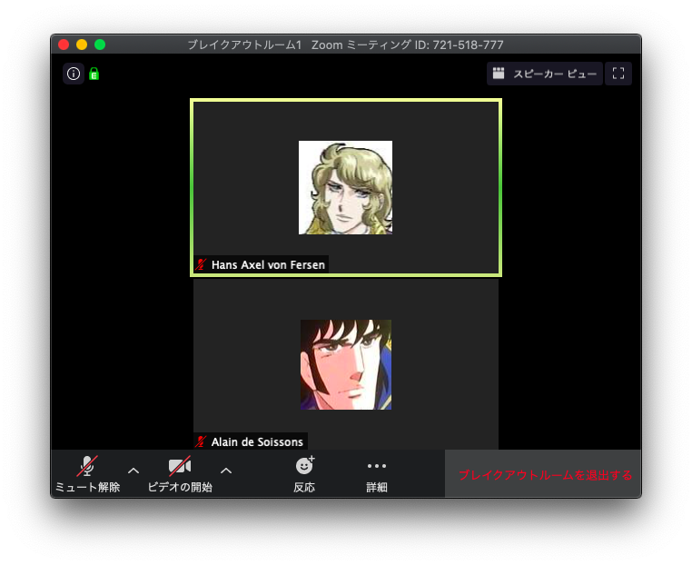
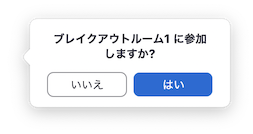
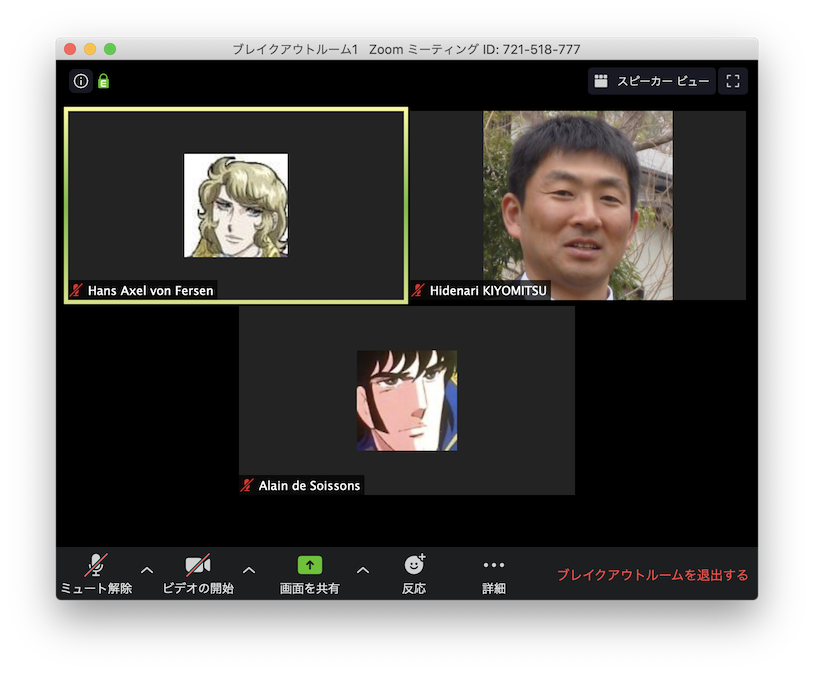
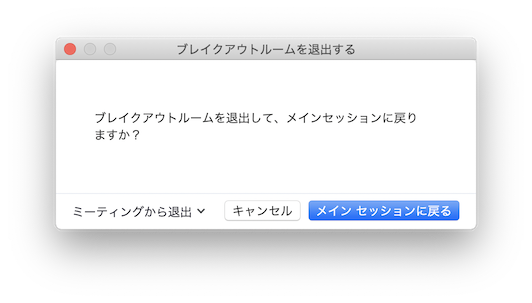

## ブレイクアウトを有効にする

[ZOOM公式サイトのマイページ](https://zoom.us/profile/setting{:target="_blank"}) で設定を変更します．
  1. 個人の設定で
  1. ミーティングの設定項目の中にある
  1. ミーティングにて（詳細）グループの最初にある「ブレイクアウトルーム」を有効にするスライダーをON

## ミーティングでブレイクアウトを設定

ブレイクアウトが有効になると，メニューに「ブレイクアウト」が追加されます．

メニューの「ブレイクアウト」からブレイクアウトルームの設定をします．

ミーティングルームを何個かのブレイクアウトルームに分割します

## 学生をグループに分ける

ブレイクアウトルームダイアログで，学生グループとブレイクアウトルームを対応づけます

学生を入れ替えています．

「すべてのルームを開ける」でブレイクアウトルームを開始します．

## ブレイクアウトルームに参加

ブレイクアウトルームに割り当てられた学生さんは下のようなメッセージを受け取ります．

参加するをクリックすると，

割り当てられたグループのブレイクアウト・ミーティグルームに参加します．グループワークが開始されるはずです．

教員はブレイクアウトルームダイアログの各ブレイクアウトルームの右にある参加ボタンを押して

参加しますか？「はい」で参加します．

他のブレイクアウトルームに参加する時は，既に参加しているブレイクアウトルームを退出します．

メインセッションに戻ります．
