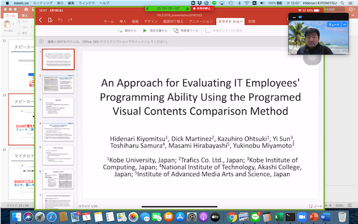
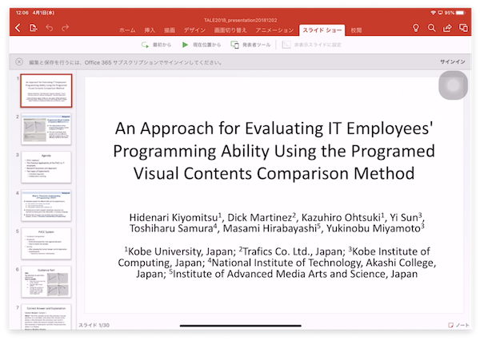
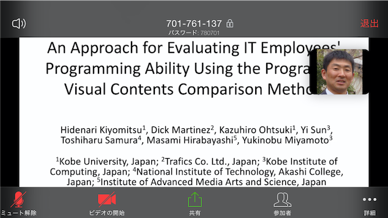
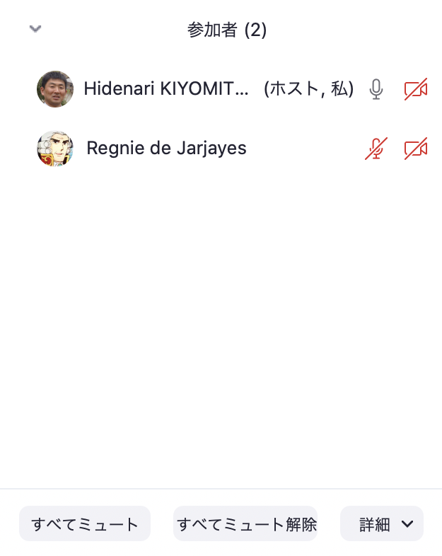

# 遠隔授業での使い方（教員用）
このページは，ZOOMミーティングでよく使う

- [画面共有](#画面共有)
- [チャット](#チャット)
- [参加者の管理](#参加者の管理)

を説明しています．

ミーティングルーム画面の下（または上）にメニューがあります．

（隠れているかもしれないので，マウスを画面の下（または上）に移動してみてください）

## 画面共有
PowerPoint，Word，Webページ などの資料を提示する（画面共有）

メニューの「画面を共有」をクリックすると，ダイアログが出ます．

&#9312;共有するウィンドウを選択

からの

&#9313;画面の共有ボタンを押す

で，指定したウィンドウを学生に見せることができます．(教員の見ている画面をそのまま共有したい場合は，「デスクトップ」を選択します)

(ホスト側画面：緑の枠線の内側を参加者と共有)

画面の共有の終了は，画面の上（または下）に出ている「共有の停止」を押します．

参加者からは以下のように見えています．

(参加者側画面)

スライドショーをスマートフォンで見ると，

(スマートフォンで共有した時の画面：iPhone 7)

\*  教員の顔(ホストのビデオ)はスマートフォン側の操作で非表示にできます．

画面共有中はメニューが画面の上部か下部に隠れてしまうので，「共有の停止」の左に表示されているミーティング ID のところにマウスカーソルを当てると「参加者の管理」などのメニューが出てきます．
注[^1]

## チャット
チャットで質問を受け付ける

授業中にメニューの「チャット」を押すと，全員とテキストチャットができます．この機能を使うと，チャットを用いて学生に質問を出してもらうことができます．適宜チャットを確認して，学生からの質問に回答すると良いでしょう．

## 参加者の管理

メニューの「参加者を管理」を押すと，参加者全員のコントロールができます．

  - マイクとカメラの ON/OFF（参加者の右にあるマイク・カメラのアイコンをクリック）
  - 参加者の入室許可
  - 参加者の削除（出禁）（参加者をクリックして，削除を選択）

[^1]: 画面共有中は学生のPCの画面は基本的に全画面表示になってしまい，他のウィンドウに移動することができなくなります．ここで，学生がZoomの画面をダブルクリックすると全画面表示ではなくなり，他のウィンドウに移動しやすくなります．もし教員が画面共有している間に学生にはWebブラウザなどZoom以外のウィンドウを使ってもらいたい際には，Zoomの画面をダブルクリックしてもらうよう指示出しすることをおすすめします．
